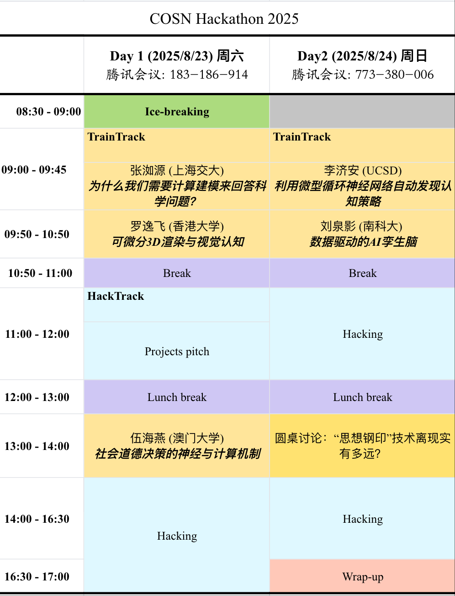

# COSN-Hackathon2025

<!-- 日程安排， insert program.png-->

## 日程安排

## 分享人
- 李济安，加州大学圣地亚哥分校神经科学博士生在读。
- 刘泉影博士，南方科技大学长聘副教授，博导，神经计算与控制实验室(NCC lab)负责人。
- 罗逸飞博士，香港大学数据科学研究院与心理系助理教授，博士生导师，主要研究方向为计算神经科学 & 计算认知科学。
- 伍海燕博士，澳门大学协同创新研究院[ANDlab](https://andlab-um.com/) PI，加州理工学院访问学者，致力于引入跨学科技术框架，结合人工智能与脑成像、计算模型、颅内及颅外神经信号、神经调控、虚拟现实和大数据，以探索大脑中情绪与决策的交互机制。
- 张洳源博士，目前担任上海交通大学心理学院和上海交通大学医学院附属精神卫生中心双聘课题组长，领导认知计算神经科学和脑影像课题组。
  

## 承办单位
- 南方科技大学
- 深圳理工大学
- 澳门大学

## 本次Hack中的项目
见[腾讯文档](https://docs.qq.com/sheet/DUUVHcEVkR3BNTUZW?tab=BB08J2)、子文件夹及以下的github repos:

- MEG searchlight temporal decoding算法优化([github](https://github.com/nmningmei/COSN-Hackathon2025))